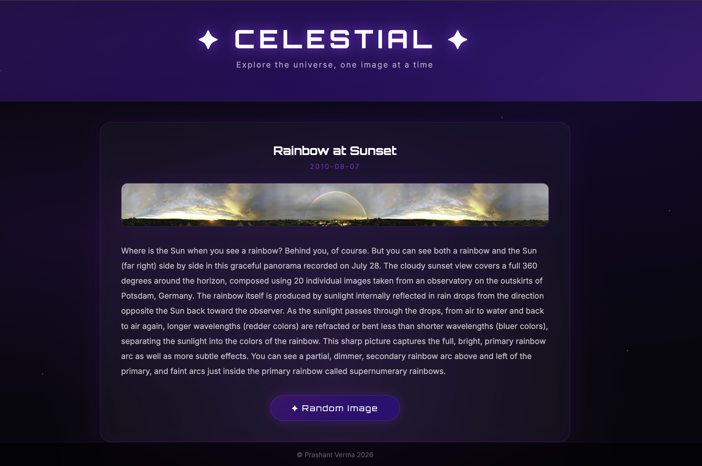

# ✦ Celestial

> Explore the universe, one image at a time.



Celestial is a full stack web app that displays NASA's 
Astronomy Picture of the Day (APOD). Every image comes 
with a title, date and detailed explanation written by 
NASA astronomers. Hit the random button to explore any 
image from NASA's archive dating back to June 16, 1995.

## Built with

- React (Vite)
- Node.js + Express
- Axios
- NASA APOD Public API — https://api.nasa.gov

## How to run

### Backend
```
cd server
npm install
nodemon index.js
```
### Frontend
```
cd client
npm install
npm run dev
```
Open http://localhost:5173

## API

Uses NASA's free APOD API.
No authentication required beyond a free API key.
Get your key at https://api.nasa.gov

## Project Structure

celestial/
  ├── client/         React frontend
  ├── server/         Express backend
  ├── assets/         Screenshots
  └── README.md